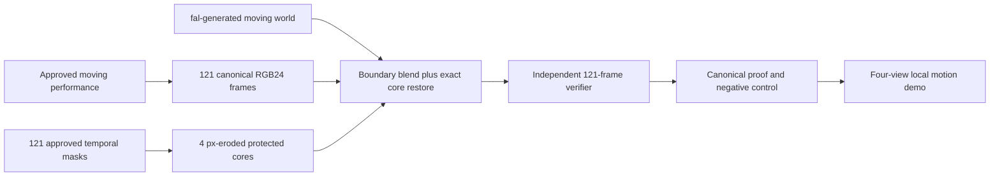

# FrameLock

**Generate an AI character performance once. Reshoot its world without rerolling the approved performance.**

FrameLock is a proof-oriented generative-video reshoot pipeline. Motion v1 keeps an approved moving character performance as the source of truth, generates a new moving world with fal, restores the declared protected core from canonical source frames and independently verifies the accepted composite before video encoding.

> Protected core verified — canonical pre-encode frame sequence.

That claim is deliberately exact and narrow. It covers RGB equality inside a frame-specific core produced by eroding the approved character mask by four pixels. It does not claim that the tracking or mask is semantically correct, that the feathered boundary is exact, that the protected character was physically relit or that the lossy MP4 preview is proof.

## Motion v1 hero

The current hero is a five-second moving-character reshoot:

- 1280 × 720, exactly 121 canonical frames and 24 FPS
- one approved moving FRM-01 character performance
- one ordered temporal matte sequence and a four-pixel-eroded protected core on every frame
- one fal-generated neon transit world
- one independently admitted FrameLock composite

The selected world came from `fal-ai/kling-video/o3/standard/image-to-video`, request `019f7806-2b52-7062-89b0-98eb664401e6`. FrameLock does not claim that Kling preserved the character. Kling generated the replacement world, then FrameLock restored the approved performance and audited the result.

The admitted canonical proof reports:

| Metric | Result |
| --- | ---: |
| Frames audited | 121/121 |
| Total protected-core pixels | 8,390,666 |
| Changed protected pixels | 0 |
| Changed protected RGB channel samples | 0 |
| Maximum protected-core channel delta | 0 |
| Deterministic recomposition | Passed |

The local `/motion-demo` route presents four synchronized views: approved source, generated world, moving mask and verified reshoot. Its deliberate negative control changes one protected channel sample by one value at frame 60. The schema-2 fixture binds the shipped corrupted PNG, its decoded RGB identity and its audited protected-core hash. The verifier catches it and renders the challenge as `FAIL` without changing the clean evidence.

The Motion v1 spend ledger currently records **$7.66575 reserved estimated cost** and **$92.33425 estimated credit remaining** from the separate $100 Motion budget. These are planning estimates, not invoice-confirmed charges.

## How Motion v1 works

1. Validate the owned 1280 × 720, 121-frame, 24 FPS source contract.
2. Decode the approved performance into canonical RGB24 frames.
3. Normalize the temporal matte into 121 ordered masks, freeze their hashes and derive a four-pixel-eroded protected core for every frame.
4. Generate replacement-world candidates with fal and select a compatible 121-frame window without frame interpolation.
5. Composite the approved moving character over the generated world, using soft alpha at the boundary while restoring the protected core exactly.
6. Reopen the persisted source, mask, generated and composite evidence independently.
7. Verify every protected-core sample, deterministic recomposition and artifact binding before admission.
8. Encode synchronized MP4 viewing derivatives only after the canonical frame proof passes.



The browser never receives a fal credential. Canonical frames and persisted audit evidence carry the claim; MP4 files are synchronized viewing previews.

## Run the local demo

The pinned toolchain is Node.js 24.18.0, pnpm 10.33.0, Python 3.14 through `uv` and FFmpeg/ffprobe 8.1.

```bash
export PATH="/opt/homebrew/opt/node@24/bin:$PATH"
pnpm install
uv sync --extra dev
pnpm dev
```

Open `http://localhost:3000/motion-demo`.

The route reads a compact, secret-free evidence mirror under `demo-evidence/motion/root` and fails closed if any bound file or public preview is missing or does not match. That portable package projects the already-admitted proof without tracing the ignored canonical-frame tree into the application bundle. The full canonical PNG sequence remains the local proof trust root and is not recreated or downloaded at startup. Nothing in this quick start deploys, publishes or submits the project.

Run the repository gates before recording or handing off a changed tree:

```bash
pnpm test
pnpm typecheck
pnpm lint
pnpm build
uv run pytest
```

The current final local tree passed Python proof/media tests (`204 passed`), Vitest (`61 files / 475 tests`), TypeScript, ESLint, optimized Next.js build, trace hygiene and production route/media/browser smoke. Earlier static-release counts remain historical and are not presented as the current Motion tree.

## Evidence map

- Selected-world record: `artifacts/motion-v1/background-selection-final.json`
- Canonical source: `artifacts/motion-v1/source/canonical-02/source-canonical.mp4`
- Approved temporal matte: `artifacts/motion-v1/matte/veed-vp9-02/temporal_matte_manifest.json`
- Canonical generated world: `artifacts/motion-v1/background/canonical-01/source-canonical.mp4`
- Admitted Motion proof: `artifacts/motion-v1/admissions/kling-background-01/motion_reshoot_admission.json`
- Negative control: `artifacts/motion-v1/negative-controls/kling-background-02/`
- Portable demo evidence mirror: `demo-evidence/motion/root/`
- Local synchronized viewing media: `public/demo/motion/`

The canonical source SHA-256 is `9882dceb76ad0b8954c92f8c8e8b9f00ea4e7812ea96a4f0307c1fa916611dc6`. The canonical generated-world SHA-256 is `9a48ef083d205d9be00051a80cfa6a8bb2eb923e62bd692e8a7bf7ff58d18610`. The admitted preview SHA-256 is `8f4cdf46a57898ea2d3bfa60605346efb1b2a3ad1cece8217fbf8bd1ac7f9850`. The preview remains a lossy viewing derivative.

## Historical static fallback

The previous AI-source static job remains immutable fallback evidence. It is not the current hero and Motion work does not rewrite its job store, artifacts or original paid-attempt ledger.

- Job `ai_713a0e7a80b7410bbe6b6d3ef54f74b7` remains `verified`.
- Its `fal-ai/kling-video/o3/standard/video-to-video/edit` request is `019f765d-0e8d-7551-afb4-941b02d355e6`.
- Its static proof audited 44,049,566 protected-core pixels across 121 frames with zero changed pixels, zero changed RGB channel samples and maximum delta zero.
- Its deliberate frame-60 one-channel corruption still fails.
- Its historical three-attempt ledger remains exhausted at `3/3`. The attempt-3 `$0.7058333334` figure is a pre-submit estimate, not a confirmed charge.

The older hardened synthetic replay remains documented in [Hardened synthetic replay evidence](./docs/HARDENED_SYNTHETIC_REPLAY.md). These predecessor records are valuable regression evidence, but neither is the active Motion v1 product claim.

## Honest limitations

- The temporal tracker or alpha model proposes the mask. Human approval and hash binding establish what FrameLock protects; FrameLock does not prove that the mask represents the “correct” character.
- The exact guarantee stops at the four-pixel-eroded core. The soft boundary is intentionally outside the equality contract and can show a halo, matte chatter or imperfect contact.
- Exact restoration preserves source pixels, so the protected character is not physically relit to match the generated environment.
- The selected shot avoids full occlusion and complex foreground crossings. Motion v1 does not solve depth ordering, multi-character interaction or arbitrary camera motion.
- MP4 files are lossy viewing previews. The canonical pre-encode frame sequence and audit carry the proof.
- Local manifests are not externally signed or independently timestamped.
- Repository publication, deployment, public media upload, demo upload and hackathon submission have not happened.

## Project documents

- [Motion v1 build goal](./docs/FRAMELOCK_MOTION_BUILD_GOAL.md)
- [Original build goal](./docs/FRAMELOCK_BUILD_GOAL.md)
- [AI-source predecessor goal](./docs/FRAMELOCK_AI_SOURCE_BUILD_GOAL.md)
- [Technical plan](./docs/FRAMELOCK_PLAN.md)
- [fal documentation research](./docs/FAL_DOCUMENTATION_RESEARCH.md)
- [Decision trace](./docs/DECISIONS.md)
- [Hardened synthetic replay evidence](./docs/HARDENED_SYNTHETIC_REPLAY.md)
- [Local definition-of-done audit](./docs/LOCAL_DOD_AUDIT.md)
- [Human handoff](./docs/HUMAN_HANDOFF.md)
- [Submission package](./docs/SUBMISSION_PACKAGE.md)
