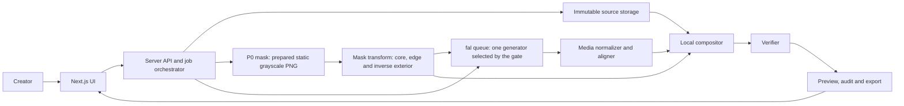
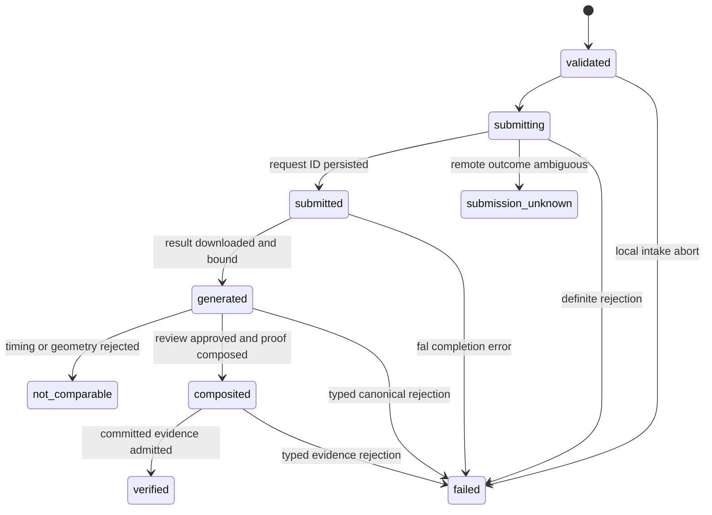

# FrameLock — Verified Generative Reshoots

## Product, technical and hackathon execution plan

| Field | Value |
|---|---|
| Status | Synthetic primitive, hardened replay and refreshed full local verification passed; real-camera definition of done pending |
| Track | Developer Track |
| Event | fal x Sequoia Video Hackathon |
| Build start | Friday, July 17, 2026 at 12:30 PM PT |
| Submission deadline | Sunday, July 19, 2026 at 9:00 AM PT |
| Effective official window | 44.5 hours |
| Planning baseline | Friday, July 17, 2026 at approximately 2:35 PM PT |
| Remaining time at baseline | Approximately 42 hours 25 minutes |
| Required submission | Public GitHub repository, 100–200 word project description and demo video up to 3 minutes |
| Core claim | Generate everything around the subject, then prove the protected core did not change |

---

## Implemented evidence — July 17, 2026

The hard primitive has passed on the owned synthetic diagnostic fixture without weakening the claim.

- LTX 2.3 Quality Inpaint attempt 1 returned 1280×768 with a 5:3 display aspect ratio. FrameLock rejected it as not comparable rather than cropping or stretching it.
- Kling O3 Standard Edit attempt 2 returned 1280×720, 121 frames at 24/1 FPS and a visibly transformed exterior. It is the selected generator. The third approved attempt was not spent.
- The two-phase proof first persists all generated-frame hashes and exact overlays for frames 0, 60 and 120. Final approval must name the review-manifest SHA and all three overlay SHAs.
- Proof schema v2 binds the exact model output, generated decode, foreground mask, source frames, core masks and composites. The independent verifier deterministically recomposes every frame. Review schema v2 and run schema v6 add source-audio binding; run schema v5 is the visualization-bound no-audio form.
- The hardened audit reports 121/121 frames, 121 protected-core hash matches, deterministic composition checked and passed and zero changed protected-core channel samples.
- The H.264 output remains a viewing derivative labeled **H.264 preview — not lossless proof**.
- Review preparation publishes atomically, while final proof publication uses a durable journal and commit-last marker. Node independently validates that marker, every owned output, the three proof visualizations and the exact canonical ZIP structure before promoting a job to `verified`.
- The fixed paid route persists immutable attempt and price evidence. Observations older than 24 hours or dated in the future fail before credentials, upload, reservation or submission. Budget scan plus reservation is atomic across distinct jobs, so the final authorized slot cannot be double-spent.
- The workspace now provides synchronized source/raw/derived-preview playback, hash-bound streaming, protected-core/boundary/heatmap stills and job-bound corruption downloads. Source audio is normalized locally and is the only audio eligible for a schema-v6 derived preview.
- Final local verification passes 102 Python tests with fal credentials removed, 241 Node tests, TypeScript, ESLint, the Next.js production build, Python compilation, offline locked dependency checks, secret scanning and no-spend HTTP smoke checks.
- A no-spend hardened replay of the recorded synthetic Kling result produced a valid schema-v5 run manifest, nine-output commit marker, canonical ZIP, zero-delta 121-frame audit and failing one-channel/one-pixel negative control. It did not make a network request, enter through a fresh Node job store or use real-camera media. Exact evidence is in `docs/HARDENED_SYNTHETIC_REPLAY.md`.
- Browser inspection covered the fresh intake workspace, read-only legacy synthetic verified projection and red corruption fixture at desktop and mobile widths. The implemented hardened real-job success and corruption UI remains unexercised by a real-camera transaction and still requires final browser inspection with the owned hero asset.

This is a strong technical proof, not real-camera or commercial-finish validation. The visible seam and absent physical relighting remain explicit limitations.

---

## 1. Executive decision

Build **FrameLock**, a video editing tool for creators and brand teams who want generative reshoots without allowing an important real object to drift.

The user uploads a short source clip, protects one foreground object and describes a new world. FrameLock sends the clip through a fal video editor, restores the original object with a deterministic compositor and produces an audit showing exactly which canonical decoded source-frame sample values were restored.

The winning distinction is not another prompt-to-video interface. It is a visible contract between stochastic generation and deterministic media processing:

> fal generates the transformation. FrameLock owns the guarantee.

In user-facing verification copy, the guarantee must be stated more precisely:

> Protected core verified — canonical pre-encode frame sequence.

The first version is intentionally constrained to exactly 121 frames at 24 FPS (about 5.04 seconds) in a mostly locked-off shot with one rigid, high-contrast foreground object and limited occlusion. The first generator tested is LTX 2.3 Quality video inpainting, which accepts a source video and a mask that regenerates white regions while preserving black regions. If it fails the hard gate, Kling O3 replaces it as the submission generator. Arbitrary click-to-track selection is a stretch capability until a live segmentation endpoint returns a usable temporal mask.

### Hackathon scope freeze

The baseline assumes one builder. A larger team may parallelize work, but it must not silently enlarge P0.

| Decision | Hackathon P0 |
|---|---|
| Hero media | One newly shot, owned clip prepared to exactly 121 frames at 24 FPS |
| Canonical format | 1280×720, 121 frames, 24/1 FPS, RGB24 PNG frames, 8-bit grayscale masks |
| Mask for first proof | One static grayscale PNG repeated across frames |
| Automatic mask | Add only BiRefNet after the complete manual-mask path works |
| Generator | One endpoint selected by the feasibility gate; test LTX first |
| Active work | One job and one variant in the application |
| UI | One-page stepper plus one synchronized result/proof view |
| Proof | Canonical PNG frame sequence, exact core audit and one deliberate-corruption failure |
| Demo resilience | A real completed golden run stored locally; no dependency on live completion during recording |
| Deployment | Optional; local application is sufficient for the required repository and demo |

Not in hackathon P0:

- O3 and O1 integrations alongside a working LTX path
- multiple model routes in the UI
- multiple active variants
- project CRUD
- browser-refresh recovery UI
- cancel and queue-position UX
- arbitrary MOV, VFR, rotation or aspect-ratio handling
- lasso or brush editors
- public cloud persistence

If LTX fails the generator gate, replace it with O3. Do not implement both merely to satisfy the plan.

### Why this is the right hackathon entry

- **Creativity:** It changes the mental model from “ask a model and hope” to “declare what may change and verify what may not.”
- **User value:** Product filmmakers, agencies and creators routinely need backgrounds, art direction and environments to change while logos, packaging or hero props remain real.
- **Technical execution:** The demo combines temporal masking, asynchronous model orchestration, media normalization, frame alignment, deterministic compositing, edge treatment and per-frame verification.
- **Demo clarity:** A judge can understand the value in seconds by toggling the original, generated result, protected mask and difference heatmap.

---

## 2. Product thesis

### 2.1 Problem

Generative video editors can preserve the motion and rough identity of an input, but they do not guarantee exact product geometry, typography, logos, labels or pixels. A prompt such as “keep the bottle unchanged” is a request, not a contract.

That makes otherwise impressive tools risky for brand work:

- Packaging text can mutate.
- Product proportions can drift.
- Logos can be redrawn.
- Fine surface details can disappear.
- A visually plausible result can hide material changes frame by frame.

Traditional compositing can protect the product, but it is labor intensive and normally disconnected from the generative workflow. FrameLock combines both approaches and makes the protection legible.

### 2.2 Target user

Primary persona:

> A creator or small brand team has a usable phone shot of a real product but cannot afford multiple locations, production designs or physical reshoots.

Secondary personas:

- Creative agencies producing campaign variations
- Solo filmmakers protecting a hero prop or practical costume element
- Ecommerce teams localizing environments around approved product footage
- VFX artists who want a quick generative background pass with an explicit protected plate

### 2.3 Job to be done

> When I already have an approved real object on camera, help me explore dramatically different environments without redrawing that object, and give me evidence I can inspect before I export.

### 2.4 Product promise

FrameLock may promise only what its deterministic pipeline measures:

- The **protected core** was restored from the immutable canonical decoded source frames.
- Its audited RGB24 sample values match those canonical source frames according to the reported metric.
- A separate boundary ring was blended for visual quality and is not included in the exact-core claim.
- The audit applies to the named processing stage and codec, not to every downstream re-encode.

FrameLock must not claim:

- The generative model preserved the object.
- Every visible object pixel is identical after lossy encoding.
- The temporal mask is correct through arbitrary occlusion.
- A prompt or model seed makes generation deterministic.

---

## 3. Product principles

1. **The guarantee is structural, not linguistic.** A prompt cannot be the protection mechanism.
2. **The original is immutable.** Never rewrite normalized source frames, masks or audit inputs in place.
3. **Proof stays close to the media.** Every output variant carries the source, mask version, model request and audit report that produced it.
4. **Exactness and appearance are different metrics.** The protected core is exact; the seam ring is optimized for visual quality.
5. **One strong path beats broad model support.** The hackathon build ships one mask route and one generator; the feasibility gate may test one replacement candidate before that choice is locked.
6. **A failed audit is a product result.** Never hide failure behind a green badge or a default value.
7. **The demo is the product thesis.** The audit toggle and pass/fail evidence are central, not an engineering appendix.

---

## 4. Scope contract

### 4.1 P0 feasibility proof

Before building the full UI, the pipeline must complete one primitive end to end:

1. Normalize one controlled source clip to the frozen canonical format.
2. Repeat one prepared static grayscale mask across the canonical frames.
3. Generate one altered environment with LTX, or replace LTX with O3 if the gate fails.
4. Align source, mask and generated frames.
5. Restore the protected core.
6. Produce a canonical decoded-frame audit with zero protected-core delta.
7. Encode and play a preview.

This proof may use scripts and a manually chosen file. It does not need the final interface.

### 4.2 Hackathon MVP

The MVP is complete when a user can:

- Upload one MP4 source clip that already fits the exact 121-frame, 1280×720, 24/1 FPS demo envelope.
- See strict validation for duration, resolution, frame rate and file size.
- Use the prepared static mask for the primitive, then one BiRefNet automatic foreground route only if time remains.
- Enter one environment transformation prompt.
- Generate one raw variant through the selected fal endpoint, then produce and verify its canonical composite.
- See the active job stage and persisted fal request ID without requiring refresh recovery UX.
- Review original, mask, generated, composited and difference views.
- See an honest audit report with pass/fail state and exact metric definitions.
- Export a viewable MP4 preview and a machine-readable audit manifest for the canonical frame proof.

### 4.3 Demo-complete target

For the recorded demo, prepare:

- One polished 121-frame source shot at 24 FPS (about 5.04 seconds)
- One hero product or prop with readable real-world detail
- One visually dramatic environment transformation
- One raw model result and one FrameLock composite derived from that exact same request
- One audit view showing the protected core and boundary ring
- One failure case or honesty moment showing that the system refuses a false pass

A second environment may be generated only after the product path is stable and the user explicitly expands the paid-attempt authorization. After the remaining third slot is used for one real-camera generation, a literal second fresh real-camera generation exceeds the initial cap. It is not an MVP application feature.

### 4.4 Stretch goals, in order

1. BiRefNet automatic foreground mask
2. A second completed environment
3. Seam-ring controls: erosion, dilation and feather radius
4. SAM 3 or SA2VA arbitrary-object temporal masks
5. Signed audit manifest or downloadable provenance bundle
6. Reusable project history and Assets integration
7. Multi-object protection

### 4.5 Explicit non-goals

- General-purpose video editor
- Timeline, trimming or multi-clip assembly UI
- Unbounded input duration
- Mobile application
- Full arbitrary occlusion handling
- Frame-by-frame generative inpainting
- Training or deploying a custom model
- Recreating fal Sandbox, Workflows or Assets
- Supporting every fal video model
- Claiming cryptographic provenance of the camera original
- Production-grade accounts, billing, organizations or team permissions

### 4.6 Hero asset and rules evidence

Shoot the hero footage during the event. Use an owned box or bottle with a new fictional **FRAMELOCK** label, one large logo and one line of smaller text that makes model drift visible. Capture at least 5.1 seconds at 1280×720 and 24 FPS with a locked camera, high-contrast background and a stationary product, then prepare an exact 121-frame hero clip. Let the generated exterior supply the motion; the P0 static mask must cover the same silhouette on every frame.

Preserve:

- original camera file timestamp and hash
- a short behind-the-scenes still or clip
- request IDs and locally downloaded fal outputs
- licenses for any dependency, font, sound or included asset
- Git history showing work began after kickoff

Do not use third-party brands, copyrighted characters, celebrity likenesses or unlicensed music. The Developer Track does not require fal session logs, but request IDs and run evidence strengthen the technical story.

---

## 5. Core user experience

The sections below describe the full conceptual flow. The hackathon implementation renders them as a one-page stepper and one results workspace, not five independent application screens.

### 5.1 Screen 1: Source

The first screen asks for:

- Source video
- Project name
- Optional short note describing the real object

Immediately show:

- Duration
- Dimensions
- Frame rate
- Codec
- File size
- Validation result

The UI explains the demo envelope: exactly 121 frames at 24 FPS, stable framing, one clear foreground object and limited occlusion.

### 5.2 Screen 2: Protect

Display the first frame and mask preview.

Modes:

- **P0 static mask:** one 8-bit grayscale PNG is repeated across all frames of the locked shot.
- **Automatic foreground stretch:** BiRefNet v2 produces a temporal mask after P0 passes.
- **Post-MVP click to track:** SAM 3 or SA2VA only if a live test returns a usable temporal matte.

Current P0 controls:

- Mask overlay opacity
- Scrubbable frame preview

Protected-core erosion and boundary-feather controls remain P1. P0 uses the
frozen radius-four transform and shows the derived masks without allowing those
proof semantics to drift interactively.

The UI visually distinguishes:

- Protected core: exactness contract
- Boundary ring: blended seam, excluded from exactness contract
- Editable environment: generative region

### 5.3 Screen 3: Reshoot

The user supplies an environment-only instruction, for example:

> Keep the original camera movement and timing. Transform everything except the foreground product into a flooded neon convenience store at night, with reflections and cinematic blue-magenta lighting.

The prompt template must not imply that the model itself guarantees protection. It should focus the model on the environment and desired art direction.

Show:

- Selected model
- Expected input constraints
- Cost estimate if available
- Job state and persisted request ID

P0 has no user cancellation control or promised queue-position display.

### 5.4 Screen 4: Verify

The results workspace has synchronized playback and these views:

- Original
- Raw model output
- FrameLock composite
- Protected core
- Boundary ring
- Changed-pixel heatmap
- Side-by-side or wipe comparison

The headline badge is one of:

- **Verified master:** all required canonical-frame core metrics passed
- **Failed:** at least one required metric failed
- **Not comparable:** geometry or timing alignment was not valid
- **Incomplete:** generation or verification did not finish

Never convert an unknown or incomplete result into “Verified.”

### 5.5 Screen 5: Export

Exports:

- Browser-compatible MP4 labeled **Preview derived from verified canonical frames**
- Audit JSON
- Complete deterministic 121-frame canonical RGB24 PNG ZIP and its export manifest

The green badge applies only to the canonical PNG frame sequence. It must not appear on the MP4 as though the lossy delivery file itself passed a zero-delta audit. A separately re-decoded MP4 audit, if implemented, receives its own labeled result.

---

## 6. System architecture



### 6.1 Recommended application stack

- **Frontend and server routes:** Next.js with TypeScript and dedicated server-only Route Handlers
- **fal integration:** `@fal-ai/client` for server-side storage and read-only queue status/result; no generic browser proxy
- **Job execution:** one native paid `fetch` POST with retries and fallback disabled, followed by SDK status polling and `queue.result()` for the persisted request ID
- **Media inspection:** `ffprobe`
- **Decode, normalize and encode:** FFmpeg
- **Compositing and audit:** one Python CLI using NumPy/OpenCV, invoked from the Next.js server process
- **Temporary project state:** filesystem-backed `job.json` and immutable run directories
- **Validation:** Zod schemas at API boundaries
- **UI:** native video elements and a Canvas overlay; avoid a full editing framework

The primary runtime is local. A deployed site is optional and must not drive architecture decisions during the hackathon. Filesystem state and local FFmpeg are not presented as a serverless production design.

### 6.2 Why the fal queue is the default

Video jobs are long-running. fal's queue provides durable request IDs, status and logs. FrameLock's paid boundary deliberately opts out of automatic retry because fal exposes no documented idempotency key for the selected request. P0 persists the request ID and polls status instead of holding one blocking request open; it does not implement cancellation or a dedicated refresh-recovery experience.

New accounts begin with a concurrency limit of two in-progress model requests. FrameLock should submit variants safely and let excess work remain queued rather than assuming three-way parallel execution.

### 6.3 Why not fal Workflows for the core proof

Workflows are useful for model-to-model DAGs and streamed intermediate events. FrameLock's differentiator, however, is deterministic restoration and verification using local media operations. Keeping that logic in application code makes the contract inspectable, testable and independent of workflow-node limitations.

Workflows may be added later for model-only branches, not as the only copy of the proof logic.

### 6.4 Why not fal Serverless or Compute

The documented Serverless and Compute paths are powerful but access can be gated. The hackathon critical path should use Model APIs and local/server runtime primitives that are already available. A custom GPU deployment does not improve the core proof enough to justify access and setup risk.

---

## 7. Data and state contracts

Keep the first contracts small and immutable. Optional details can live in nested metadata rather than expanding every core record.

The following contracts describe the product boundary. P0 may serialize one project, one mask and one variant into a single `job.json`; it does not need a database or general CRUD layer.

### 7.1 Project

| Field | Purpose |
|---|---|
| `id` | Stable project identifier |
| `name` | Human-readable name |
| `createdAt` | Creation timestamp |
| `sourceAssetId` | Immutable normalized source reference |
| `activeMaskId` | Mask version selected for composition |
| `status` | Project-level state |
| `variantIds` | Generated variants |

### 7.2 MediaArtifact

| Field | Purpose |
|---|---|
| `id` | Content-addressed or stable identifier |
| `kind` | source, mask, model-output, composite, preview or proof |
| `uri` | Local or fal-hosted URL |
| `sha256` | File hash |
| `media` | Width, height, fps, duration, codec and frame count |
| `createdAt` | Creation timestamp |
| `parentIds` | Inputs used to derive it |

### 7.3 Variant

| Field | Purpose |
|---|---|
| `id` | Stable variant identifier |
| `sourceArtifactId` | Immutable canonical source snapshot |
| `sourceMaskId` | Immutable confirmed foreground mask snapshot |
| `coreMaskId` | Immutable binary protection-core mask |
| `editMaskId` | Immutable inverse mask sent to a masked generator |
| `maskTransform` | Threshold, erosion, dilation, feather and polarity |
| `prompt` | Exact transformation prompt |
| `endpointId` | Exact fal endpoint |
| `requestId` | fal queue request ID |
| `status` | State machine value |
| `modelOutputId` | Raw model artifact |
| `compositeId` | Deterministic composite artifact |
| `auditId` | Audit report |

At submission, compute and store a generation-input digest over the canonical source ID, generator edit-mask ID, prompt, endpoint and normalized model parameters. Never look up a mutable `Project.activeMaskId` during later composition or audit.

### 7.4 AuditReport

| Field | Purpose |
|---|---|
| `version` | Audit schema version |
| `sourceArtifactId` | Audited source frames |
| `compositeArtifactId` | Audited composite frames |
| `maskArtifactId` | Mask and parameters |
| `stage` | Pre-encode raw, lossless export or decoded preview |
| `thresholds` | Explicit pass/fail rules |
| `summary` | Aggregated metrics and verdict |
| `frames` | Per-frame metrics and hashes |
| `createdAt` | Audit timestamp |

### 7.5 Variant state machine



These are the shipped persisted states. State transitions are validated centrally, and invalid combinations such as `verified` without an audit ID are rejected at the API boundary. A fal `COMPLETED` status containing `error` or `error_type` transitions to `failed`, not `generated`; `generated` requires a fetched and schema-validated result. `submission_unknown` is terminal and never retries automatically.

After approval, canonical finalization or evidence-integrity failures use the existing terminal `failed` state with one safe typed code: `CANONICAL_FINALIZATION_REJECTED`, `CANONICAL_EVIDENCE_INVALID` or `CANONICAL_EVIDENCE_INCOMPLETE`. P0 has no cancellation UI or `DELETE` API. Remote queue cancellation and multi-project recovery are later extensions.

### 7.6 Mask types and polarity

Do not use one numeric mask type for every operation.

- `coreMaskArtifact`: persisted grayscale PNG bytes in `uint8 {0,255}`, where `255` means protected
- `protectCore`: in-memory boolean array computed only as `coreMaskArtifact == 255`, used for direct copy and audit membership
- `protectAlpha`: in-memory float32 `[0,1]`, straight alpha, used only for boundary blending
- `editMaskArtifact`: persisted grayscale video bytes in `uint8 {0,255}` with endpoint-specific polarity; for LTX, `255` means regenerate and `0` means preserve

The compositor and verifier must explicitly perform the `255 → true` conversion when loading a core-mask artifact. They must never treat arbitrary nonzero image bytes as an implicit boolean mask. The LTX edit mask is derived separately by polarity inversion and is never reused as `protectCore`.

Every mask artifact records:

- semantic role
- numeric domain
- white/one meaning
- source artifact
- threshold and transform parameters
- SHA-256

Tests must prove that polarity inversion is correct before any paid generation request.

---

## 8. Detailed media pipeline

### 8.1 Stage A — ingest and immutable normalization

Input checks:

- MP4 only for P0
- exactly 121 decoded video frames
- 1280×720
- 24/1 FPS constant frame rate
- stable landscape orientation
- maximum 50 MB
- record whether audio is present

Reject rather than normalize arbitrary P0 inputs. MOV, portrait, VFR, rotation and broader model envelopes are documented future support, not submission requirements.

Hero preparation happens before upload: capture at true 24/1 CFR and select 121 consecutive frames. If the camera take is VFR or requires duplicated, dropped or interpolated frames, reshoot it for P0. Hash and retain the camera file, but the guarantee begins only at the immutable PNG frames decoded from the accepted upload.

Normalize once to a canonical working representation:

- time base `1/24`, with canonical presentation time `t_n = n/24` seconds for frame indices `n = 0…120`
- exactly 121 frames and a nominal video interval of `121/24` seconds (about 5.0417 seconds)
- 1280×720 square-pixel landscape
- RGB24, eight bits per R, G and B channel
- one PNG per frame as the authoritative proof representation
- frame indices starting at zero in presentation order
- FFmpeg's explicit BT.709-to-RGB conversion command and version recorded in the manifest
- input and canonical color primaries, transfer characteristic, matrix, range and chroma-location metadata recorded in the manifest
- separate source audio normalized to 48 kHz stereo PCM for working use

Write a metadata record and SHA-256 hash. Do not overwrite the source or normalized frames later.

### 8.2 Stage B — temporal mask

Implementation order:

1. **Prepared static mask:** one 8-bit grayscale PNG repeated across all 121 frames of the locked shot. This proves generation, composition and audit independently of segmentation quality.
2. **BiRefNet v2 video stretch:** automatic foreground mask with `output_mask: true` and `refine_foreground: true` after the primitive passes.
3. **Post-MVP investigation:** SAM 3 segmented output and SA2VA explicit mask-video output.

BiRefNet is documented as foreground/background dichotomous segmentation. It should not be described as arbitrary-object tracking.

Mask normalization:

- Match canonical width and height exactly.
- Match frame rate and frame count.
- Convert to an eight-bit single-channel representation.
- Record threshold, erosion, dilation and feather settings.
- Preserve the unmodified model mask as a separate artifact.

After thresholding, core membership is encoded as exactly `255` and exterior as `0`.

Derive two regions:

- `coreMask`: eroded binary mask used for exactness verification
- `edgeMask`: ring between the protected core and outer foreground boundary, used for feathering

### 8.3 Stage C — generative reshoot

Preferred experimental endpoint:

`fal-ai/ltx-2.3-quality/inpaint`

The live schema requires a source video and a mask video. White mask regions are regenerated and black regions are preserved from the source. This maps directly to FrameLock: invert the confirmed foreground mask so the protected object is black and the environment is white.

Initial LTX request rules:

- Use the normalized source clip and an exactly aligned inverse exterior mask.
- Set `frames_per_second: 24` and `num_frames: 121` for the exact canonical timeline.
- Set `video_strength: 1`.
- Start with 15 inference steps.
- Set `generate_audio: false`; remux source-derived audio locally when present, otherwise emit a silent preview.
- Set `enable_prompt_expansion: false`, or persist both the submitted prompt and the response's final `prompt` value.
- Prompt for the new environment, lighting and art direction.
- Store the exact prompt, endpoint, seed, request ID, timestamps and result URL.
- Download the result locally as soon as it completes.

Why this route comes first:

- Mask conditioning should reduce full-frame geometry drift.
- The model is asked to generate only the declared exterior.
- The deterministic compositor still restores the protected core afterward.

Needs a live test:

- current price and latency
- quality when most of the frame is white/regenerated
- edge quality around the black protected region
- actual output timing and frame count
- whether “preserved” means exact pixels or only structural preservation

High-creativity fallback endpoint:

`fal-ai/kling-video/o3/standard/video-to-video/edit`

Kling rules:

- Use the normalized source clip.
- Set `keep_audio: false`; remux source-derived audio locally when present, otherwise emit a silent preview.
- Prompt for environment, lighting and art direction.
- Avoid asking for object replacement.
- Apply the strict comparability gate before composition.

Documented-price fallback:

`fal-ai/kling-video/o1/video-to-video/edit`

O1 has a documented snapshot price of $0.168 per output second and similar input constraints. It is useful when O3 availability, price or output alignment is unsuitable. Do not assign O1's price to O3 or LTX.

### 8.4 Stage D — output comparability and alignment

Before composition, compare every generator output:

- Width and height
- Display aspect ratio
- Duration
- Frame rate
- Frame count
- Start time
- Rotation metadata
- Audio duration

FrameLock must not silently stretch incompatible output and then claim verification. P0 uses these frozen rules:

1. Scale a 16:9 output to 1280×720. Reject a different display aspect ratio.
2. Decode frames in presentation order and record the generator file's original start time, frame rate, timestamps, frame count and duration before normalization.
3. Require exactly 121 decoded output frames. P0 performs no frame insertion, deletion, interpolation, nearest-timestamp remapping or speed change. A mismatch is `not_comparable` and fails that generator's gate.
4. Require strictly increasing decoded presentation timestamps and `max_n |(PTS_n - PTS_0) - n/24| <= 0.001` seconds. A larger timing residual is `not_comparable` even if the container reports 24 FPS.
5. Reindex the accepted frames onto the canonical timestamps `t_n = n/24` for `n = 0…120`. This discards the recorded absolute start-time offset and snaps each accepted relative timestamp by at most 1 ms. It does not insert, delete, interpolate or reorder frame samples; the manifest records the maximum snap.
6. Require the declared output frame rate to be 24/1 CFR and its declared or measured duration to be within `1/24` second of `121/24` seconds. Any exception is `not_comparable`.
7. Display first, middle and final mask-overlaid frames for a human geometry approval. Automatic media checks cannot prove that a creatively reframed background is visually compatible.
8. If the human approval fails because the source object no longer belongs in the generated geometry, return `not_comparable`.

LTX should align more naturally because it consumes the source and mask together, but the schema is not proof of output equivalence. Kling requires an especially strict visual geometry check. During the feasibility spike, calculate mask-overlaid preview frames before committing to either model.

### 8.5 Stage E — deterministic composition

Let:

- `S_t(x,y)` be the normalized source pixel at frame `t`.
- `G_t(x,y)` be the aligned generated pixel.
- `C_t(x,y)` be the binary protected-core mask.
- `A_t(x,y)` be the full foreground alpha including a feathered edge.

Before blending, source and generated frames must be normalized into the same canonical RGB color space, range, bit depth and dimensions. When generated color metadata is absent, record the explicit `explicit_bt709_limited_fallback` assumption rather than describing it as source-declared. `A_t` is straight alpha. Compute the feathered boundary in linear-light float32, convert back to canonical RGB24 with one specified rounding rule, then overwrite the protected core in the final integer buffer.

The visual composite is:

```text
O_t = A_t * S_t + (1 - A_t) * G_t
```

The exact protected-core contract is stronger:

```text
For every pixel where C_t = 1, O_t := S_t by direct copy.
```

The implementation should perform the direct protected-core copy after any feathering operation so floating-point blending cannot alter core values.

Recommended order:

1. Composite source over generated background with the feathered full alpha.
2. Copy source pixel bytes directly wherever boolean `protectCore` is true.
3. Save each pre-encode composite as an RGB24 PNG with the canonical frame index.
4. Have the verifier independently reopen the persisted canonical source PNGs, binary core-mask PNGs and composite PNGs. It must not audit the compositor's in-memory buffer.
5. Bind every generated-frame file hash and canonical RGB hash, plus the pre-approval review manifest and exact review-overlay hashes, before finalization.
6. Deterministically recompose every frame from the proof-bound source, generated, mask and compositor parameters and require byte-identical persisted composites.
7. Encode a separate browser preview.

### 8.6 Stage F — verification

Required per-frame core metrics:

- Protected-core pixel count
- Changed protected-core pixel count
- Maximum absolute channel delta
- Mean absolute channel delta
- SHA-256 of the ordered protected-core source bytes
- SHA-256 of the ordered protected-core output bytes

Canonical hash serialization:

- frames are ordered by zero-based frame index
- pixels are visited row-major, `y` then `x`
- a pixel belongs to the core only when its binary mask byte is `255`
- each included pixel contributes exactly three bytes in `R, G, B` order
- no alpha or padding bytes are included
- the mask PNG hash and full source-frame PNG hash are stored alongside the protected-byte hash

Required summary metrics:

- Frames audited
- Frames with a non-empty core
- Total core pixels
- Total changed core pixels
- Worst maximum channel delta
- Core hash match count
- Mask coverage percentage
- Geometry/timing transformations applied
- Audit stage

MVP canonical-frame pass condition:

```text
changedCorePixels == 0
AND worstMaxChannelDelta == 0
AND every non-empty core frame hash matches
AND framesWithNonEmptyCore == framesAudited
AND totalCorePixels > 0
AND comparability checks passed
AND every proof-bound artifact hash matches
AND pre-approval review evidence matches
AND deterministic recomposition passed
```

Boundary quality is reported separately using metrics such as seam width, edge-ring mean delta or a visual spot check. It does not change the exact-core verdict.

### 8.7 Stage G — export

Generate:

- canonical RGB24 PNG frame sequence as the authoritative verified master
- H.264 MP4 labeled as a preview derived from verified canonical frames
- JSON audit manifest

Audio policy:

- discard model-generated audio for P0
- normalize source audio to 48 kHz stereo
- trim or pad silence to exactly `121/24` seconds, then record the operation
- if no source audio exists, export a silent preview
- audio is outside the pixel-verification claim

If the exported MP4 is re-decoded and audited, report it as a second result. Do not reuse the pre-encode zero-delta badge for the lossy export without labeling the stage.

---

## 9. Server API surface

P0 uses one real-job resource rather than general project CRUD. The primary
surface is the only path allowed to create a new paid submission.

| Method | Route | Purpose |
|---|---|---|
| `POST` | `/api/jobs` | Validate and persist the exact source, single-frame static grayscale mask and prompt, then create one active real job |
| `GET` | `/api/jobs/budget` | Read the atomic global paid-attempt ledger before confirmation |
| `GET` | `/api/jobs/:jobId` | Read the current stage, request ID, failures and hash-bound evidence metadata |
| `POST` | `/api/jobs/:jobId/pricing` | Make one authenticated no-generation price lookup and persist a strict receipt bound to the job, generation, provenance file and endpoint |
| `POST` | `/api/jobs/:jobId/run` | Verify the generation digest, exact confirmation and pricing-observation digest, then submit the fixed Kling route |
| `POST` | `/api/jobs/:jobId/poll` | Reconcile the one persisted fal request and fetch a completed result without resubmitting |
| `POST` | `/api/jobs/:jobId/review` | Run the automatic comparability gate and prepare the fixed frames 0, 60 and 120 for visual review |
| `POST` | `/api/jobs/:jobId/approve` | Bind the human geometry approval, compose canonical frames, audit the protected core and publish evidence commit-last |
| `GET` | `/api/jobs/:jobId/media/:asset` | Stream only allowlisted, state-gated and hash-verified media or evidence artifacts |

The earlier synthetic feasibility endpoints remain only so the already-spent
attempts can be inspected or an already-persisted request can be reconciled.
They cannot create a new fal request and are not alternative generation paths.
The demo-media route is a read-only compatibility projection.

| Method | Compatibility route | Purpose |
|---|---|---|
| `GET` | `/api/jobs/synthetic?attempt=1` | Read or poll the historical LTX feasibility attempt |
| `GET` | `/api/jobs/synthetic/kling` | Read or poll the historical Kling synthetic attempt |
| `GET` | `/api/demo/media/:asset` | Serve allowlisted media from the verified legacy synthetic proof projection |
| `POST` | `/api/jobs/synthetic` and `/api/jobs/synthetic/kling` | Always return `410 Gone`; legacy paid submission is closed |

Automatic mask creation, remote fal cancellation, multiple variants and project history add routes only after P0 passes.

The explicit pricing route accepts no body or query parameters, performs no
upload or generation and returns only the strict client-safe receipt. The paid
route reopens that exact persisted receipt and the bound source, mask and
provenance bytes. It rejects a pricing observation that is more than 24 hours old or
later than the server's current time. It returns HTTP 409 with
`PRICING_OBSERVATION_NOT_CURRENT` before credential validation, upload, attempt
reservation or submission, so stale pricing cannot consume budget or invoke
fal generation. A missing, tampered or cross-generation receipt also fails
before spend. The human must obtain, review and explicitly authorize the fresh
pricing digest before retrying.

Security requirements:

- Never return `FAL_KEY` to the client.
- Allowlist the exact model endpoints the proxy can call.
- Reject arbitrary target URLs.
- Add simple authentication or a hackathon access token before public deployment.
- Add rate limits or a one-job-at-a-time policy to protect credits.
- Validate upload size and media type before invoking FFmpeg.

P0 is localhost-only. If the application is made public, add per-job authorization, streamed-byte limits, decoded-pixel/frame/duration limits, disk and CPU quotas, generated filenames, isolated temporary directories, child-process deadlines, disabled non-file FFmpeg protocols and an allowlist for redirected model-artifact hosts.

---

## 10. fal integration contract

### 10.1 Authentication

- Keep `FAL_KEY` in server environment configuration.
- Use an API-scoped key unless an Admin operation is truly required.
- Do not place a permanent key in browser code.

### 10.2 Uploads

- Browser files should be uploaded through fal storage or the application server.
- Persist returned fal URLs and local downloaded artifacts.
- Assets ingestion is optional and happens only after a file already has a fal-hosted URL.

### 10.3 Queue calls

- Submit with an explicit endpoint and validated input.
- Persist `requestId` before returning success to the UI.
- Stream or poll status with logs.
- Treat completion with an error payload as failure.
- Do not implement user-facing cancellation in P0. If added later, model `cancel_requested` and late completion correctly.
- Send `X-Fal-No-Retry: 1` on the single paid POST and request fal fallback disablement. Never automatically retry an ambiguous paid result.
- Set a reasonable start timeout only if the demo prefers failure over a long queue.
- Do not treat `startTimeout` as a total inference deadline.
- For the hero provenance run, request `x-app-fal-disable-fallback: true` if the endpoint supports it. If fallback cannot be disabled or independently observed, record the requested endpoint and do not overclaim the actual backend model.

### 10.4 Webhooks

Webhooks are optional for the hackathon. If used:

- Make handlers idempotent by request ID.
- Verify Ed25519 signatures against fal JWKS.
- Enforce the documented five-minute timestamp window.
- Return quickly because initial deliveries have a 15-second timeout.
- Expect repeated delivery during fal's retry window.

Polling or status streaming is simpler for the first build.

### 10.5 Storage policy

- Download final demo artifacts locally immediately.
- Set explicit object lifecycle preferences.
- Set source-upload lifecycle and ACL at upload time.
- Set generated-output lifecycle and initial ACL on the inference request where supported.
- Verify both policies independently; an inference output header does not retroactively protect the uploaded source.
- Treat footage as public-by-link until the applied ACL or signed-URL behavior has been verified.
- Use `X-Fal-Store-IO: 0` if avoiding stored JSON I/O is important, while recognizing it does not delete CDN media.

---

## 11. Feasibility spike and decision gates

### Gate 0 — credentials and toolchain

Timebox: 15 minutes.

Pass when:

- `FAL_KEY` works from a server-side script.
- The live schema and authenticated current price are retrieved for LTX inpaint.
- FFmpeg, Python, NumPy/OpenCV and the canonical source decode work.
- The server-side client can validate the LTX request shape without exposing the key; the first paid queue round-trip occurs in Gate 2 after the canonical source and mask exist.

If blocked:

- Use the fal Playground/Sandbox for immediate model testing.
- Ask fal office hours for endpoint access and schema confirmation.
- Do not scaffold the full product until at least one generation succeeds.

### Gate 1 — canonical source and static mask

Timebox: 30 minutes.

Pass when:

- The newly shot hero clip passes the frozen 1280×720, 24/1 FPS, 121-frame contract.
- One grayscale PNG mask covers the hero product and is repeated across every frame.
- The mask produces a non-empty boolean core, float boundary alpha and correctly inverted LTX edit mask.
- Polarity tests prove that the object is black/preserved and the environment is white/regenerated.

Do not test SAM 3, SA2VA or BiRefNet inside this gate. Automatic masking begins only after the full static-mask primitive passes.

### Gate 2 — generation quality and comparability

Timebox: 75 minutes, including queue wait. While LTX runs, implement the local compositor and negative audit fixture.

Pass when:

- LTX produces a visibly transformed exterior from the inverse mask.
- The output passes the exact 121-frame, 24/1 FPS comparability contract and can be reindexed with no frame resampling and at most 1 ms of timestamp snap.
- The normalized mask still covers the hero object's intended position.
- First, middle and final overlays pass human geometry review.

If LTX transformation is weak or fails:

- Verify mask polarity first, then try one more explicit environment prompt.
- Increase steps only once if quality, rather than geometry, is the problem.
- Retrieve O3's authenticated current price, then replace LTX with one Kling O3 Standard test. Do not integrate both.

If the replacement O3 test fails comparability, pivot the source once. Do not add O1 inside the P0 gate.

### Gate 3 — proof primitive

Timebox: 40 minutes.

Pass when:

- Direct core copy produces zero changed canonical-source samples in the persisted PNG composite.
- The boundary seam is acceptable in motion.
- A JSON report describes the exact audited stage.
- A deliberate one-channel, one-pixel corruption makes the independent verifier fail.

Only after Gate 3 passes should the main UI build begin.

### Build-stop boundary

The planned gates total 160 minutes. Three hours after focused work begins is the hard stop, leaving 20 minutes for queue variance and one source adjustment.

The gate already uses the narrowest viable product: locked camera, one 121-frame clip, one static mask, one generated world and one verifier. If that path does not produce a visually convincing same-job result, zero-delta canonical audit and caught corruption within three hours, switch concepts. Do not spend the remaining window building a false guarantee.

---

## 12. Execution schedule

This schedule is anchored to the planning baseline and should slide only when model queue time forces it. Preserve the decision gates even if clock times move.

### Friday, July 17

#### 2:35–5:35 PM — prove the primitive

- Configure fal credentials and live model discovery.
- Shoot the new controlled hero footage and create one static grayscale mask.
- Run one LTX inverse-mask inpaint.
- Replace LTX with one Kling O3 test only if LTX fails the generator gate.
- Normalize, composite and produce a first audit.
- Run the deliberate-corruption negative test.
- Lock the one submission generator.

Use office hours to ask:

- Which endpoint is recommended for a raw, temporally aligned arbitrary-object mask: SAM 3 or SA2VA?
- Is `fal-ai/ltx-2.3-quality/inpaint` expected to preserve black-mask timing and geometry exactly?
- Does Kling O3 edit preserve input duration, FPS and spatial framing, or must callers align output?
- What are current LTX and O3 Standard prices, queue availability and concurrency limits?
- Are there hackathon-specific credits or model restrictions?

#### 5:35–6:00 PM — architecture lock

- Record endpoint IDs and schemas.
- Freeze canonical media settings.
- Freeze audit definition.
- Cut unsupported features from the plan.

#### 6:00–9:00 PM — vertical slice

- Create Next.js application and server-only fal integration.
- Implement source upload and metadata inspection.
- Persist one job and request ID.
- Use the static mask path.
- Submit and retrieve one generation job.

#### 9:00 PM–12:00 AM — proof viewer and automatic-mask stretch

- Build the one-page result/proof view.
- Add BiRefNet only if the golden static-mask path works twice.
- Back up every successful request ID and artifact.

Hard Friday-night milestone:

> One end-to-end result can be produced twice from the application path, not only from a notebook or ad hoc command.

### Saturday, July 18

#### 8:00–11:30 AM — usable product flow

- Build the Source, Protect, Reshoot and Verify one-page stepper.
- Add synchronized video comparison.
- Add honest failure states.

#### 11:30 AM–1:00 PM — first demo rehearsal

- Run the hero clip end to end.
- Time generation and recovery.
- Identify the least convincing visual moment.
- Use Wonder Studios workshop or office hours only for a concrete blocker.

#### 1:00–4:00 PM — visual polish with scope control

- Improve mask preview and heatmap.
- Tune erosion and feathering.
- Finalize one strong same-job raw/composite transformation.
- Generate a second closing-montage environment only if the hero path is stable and the user explicitly expands the three-attempt cap.
- Add audit export.

#### 4:00–6:00 PM — reliability pass

- Test model error and invalid input.
- Test a deliberately altered protected pixel.
- Verify no secret reaches the client bundle.
- Download all final media locally.

#### 6:00–8:00 PM — feature freeze

After 6:00 PM, add no new model family or major feature. Fix only issues that affect:

- end-to-end completion
- audit truthfulness
- demo comprehension
- submission requirements

#### 8:00 PM–12:00 AM — demo and repository

- Record clean product footage and screen capture after the real-camera path is complete and browser-inspected.
- Assemble the three-minute demo.
- Complete README, architecture diagram and setup instructions.
- Ensure the public repository contains no keys, private inputs or cached credentials.
- Draft the project description.

Hard Saturday-night milestone:

> A complete submission package exists locally, even if Sunday polish never happens.

### Sunday, July 19

#### 6:00–6:30 AM — final verification

- Run the exact demo path once.
- Verify repository link and installation steps.
- Verify video duration under three minutes.
- Verify written description.
- Verify all artifacts open from a clean browser/session.

#### 6:30–7:15 AM — upload and submit

- With explicit user authorization, upload the final demo video.
- With explicit user authorization, create and push the public repository state.
- With explicit user authorization, submit by 7:15 AM PT to retain one hour and 45 minutes of buffer.

#### 7:15–9:00 AM — contingency only

- Fix broken links or upload failures.
- Do not re-edit the concept or add features.

---

## 13. Testing and acceptance criteria

### 13.1 Unit tests

Media validation:

- Reject unsupported container.
- Reject a decoded frame count other than 121.
- Reject dimensions other than 1280×720.
- Reject frame rate other than 24/1 FPS CFR.
- Reject non-increasing source timestamps or a normalized timestamp residual greater than 1 ms from the canonical `n/24` sequence.

Mask operations:

- Erosion always keeps the core within the original mask.
- Edge ring never overlaps pixels outside the full mask.
- Empty core produces an explicit audit failure.

Verifier:

- Identical protected bytes pass.
- One modified channel in one protected pixel fails.
- Changes outside the core do not fail the core audit.
- Missing frames or dimension mismatch return `not_comparable`.
- No metric uses a default value after read/processing failure.

State machine:

- `verified` requires a completed audit.
- Failed jobs cannot transition to generated without a new request.
- A fal completion containing an error cannot become generated.

### 13.2 Integration tests

- Source upload → normalized artifact
- fal queue submit → persisted request ID → status → result download
- Mask artifact → core/edge derivation
- Generated output → alignment → composite
- Composite → audit JSON → UI verdict
- Audit export opens and references existing artifact hashes

### 13.3 End-to-end tests

Required before submission:

1. Happy path with the hero clip and the one selected generator.
2. Invalid source or mask fails before a paid request.
3. Deliberate protected-core corruption produces a visible failure.

If BiRefNet ships, add its mask-path test. If the MP4 is re-decoded and audited, add that separately labeled result. O3 is not a mandatory test when LTX wins the generator gate.

### 13.4 Visual acceptance criteria

- The hero object remains visually stable through the entire clip.
- The generated environment is unmistakably different.
- The seam does not attract attention at normal playback speed.
- A judge can locate the protected core and understand the audit within ten seconds.
- The UI never implies that boundary pixels are exact when they are feathered.

### 13.5 MVP definition of done

All must be true:

- End-to-end path works from the application.
- One hero variant completes twice through the same application path.
- Core audit catches a deliberate corruption.
- Canonical-frame hero result reports zero changed core samples.
- Audit stage is clearly labeled.
- FAL key is server-only.
- Demo can be recorded without live model dependency.
- Public repository setup is reproducible enough for a judge or reviewer.

---

## 14. Risk register and fallback ladder

| Risk | Probability | Impact | Detection | Mitigation or fallback |
|---|---:|---:|---|---|
| SAM 3 output lacks a raw matte | High | Medium | Gate 0–1 | Try SA2VA, then BiRefNet full foreground and manual mask |
| BiRefNet mask leaks or flickers | Medium | High | Mask overlay scrub | Controlled object/background, mask cleanup, static camera |
| LTX under-transforms the exterior | Medium | High | Gate 2 visual check | Stronger prompt, one step increase, then Kling O3 |
| Kling changes framing or timing | High | High | Gate 2 comparability check | Simpler prompt, one new controlled source shot, then concept pivot |
| Seam looks pasted on | Medium | High | Motion review | Tune edge ring, choose lighting-compatible shot, reduce camera movement |
| Lossy output breaks zero-delta claim | Certain | High | Re-decoded audit | Audit raw/lossless stage and label preview separately |
| Model queue is slow | Medium | Medium | Status/queue metrics | Pre-generate demo assets, reduce variants, use durable queue |
| Concurrency limited to two | High for new account | Low | Dashboard/status | Queue variants, do not assume parallel completion |
| Model price or schema differs from docs | Medium | Medium | Live metadata check | Query live schema and pricing before requests |
| fal CDN media expires or is public | Medium | High | Storage review | Download immediately, explicit lifecycle and ACL |
| API key exposed by proxy | Low | Critical | Client bundle/network inspection | Server-only routes, endpoint allowlist, auth and rate limit |
| UI scope consumes core time | Medium | High | Friday milestone missed | Use one compact stepper/results page, no timeline editor |
| Demo depends on live generation | Medium | High | Rehearsal | Record completed results and keep local artifacts |

---

## 15. Judging strategy

### Creativity — 25%

Show a new interaction contract:

- Generative transformation with declared immutable content
- Proof view as a first-class creative interface
- A failure state that is more honest than a model confidence claim

### User value — 25%

Anchor the story in one concrete need:

> A small brand can turn one approved product shot into multiple campaign worlds without asking AI to redraw the product.

Demonstrate less reshooting, faster art-direction exploration and reviewable evidence.

### Technical execution — 35%

Expose the hard parts visually and in the repository:

- Temporal mask derivation
- Queue-based model orchestration
- Media normalization and comparability checks
- Protected core vs boundary ring
- Direct byte copy after blending
- Per-frame hashes and delta metrics
- Deliberate corruption test

The audit must be real and reproducible. A decorative percentage will weaken the project.

### Demo — 15%

The demo should produce an immediate contrast:

1. Raw generative edit mutates the product.
2. FrameLock preserves it inside a dramatically changed world.
3. Audit view proves what happened.

Avoid a long setup tour. The first transformation should appear in the first 30 seconds.

---

## 16. Three-minute demo storyboard

Target runtime: 2:35–2:45. The raw model output and FrameLock composite must come from the exact same fal request. Never use a more failure-prone model as the “before” for a different generator's “after.”

### 0:00–0:15 — hook

Show source, raw model output and verified composite for one impossible environment.

Voiceover:

> Generative reshoots are incredible until the model redraws the one thing your client already approved.

### 0:15–0:35 — problem

Show the same-job raw model result beside the source. Zoom into any changed protected-core samples, label distortion or seam risk. If the selected generator already preserves the region exactly, say so and position FrameLock as independent verification; do not substitute another model's failure.

> “Keep it unchanged” is only a prompt. It is not a guarantee.

### 0:35–1:20 — persisted results flow

- Identify the owned synthetic diagnostic fixture and static confirmed mask.
- Show protected core and seam ring.
- Show the exact persisted prompt, model endpoint and request provenance.
- Explain why the first LTX result was rejected and the Kling result was selected.
- Move directly through the completed source, raw result and canonical evidence; do not imply that upload, mask editing or live submission UI shipped.

### 1:20–1:40 — reveal

Play original, raw generation and FrameLock composite in synchronized views. Toggle the mask and wipe comparison.

### 1:40–2:00 — clean audit

Show:

- changed protected-core pixels: 0
- maximum protected-core channel delta: 0
- per-frame hash match
- separately labeled protected core, boundary ring and persisted difference heatmap

### 2:00–2:18 — negative control

Show the job-bound one-channel/one-pixel corruption result turning the audit red.
Make clear that the clean canonical sequence remains unchanged.

### 2:18–2:30 — generator decision

Show LTX rejected at 1280×768 and 5:3, then Kling selected at 1280×720,
121 frames and 24/1 FPS. Name the recorded costs without implying a new call.

### 2:30–2:40 — close

Use one diagram:

> fal handles the selected generative video call. FrameLock performs deterministic restoration, committed evidence publication and independent verification.

> Generate the world. Verify the protected core.

End on the local hero result and exact narrow claim. Show a repository URL only if publication is separately authorized and completed.

---

## 17. Repository and submission package

### Recommended repository structure

```text
video/
├── app/                    # Next.js routes and UI
├── components/             # Source, mask, comparison and audit views
├── lib/
│   ├── contracts/          # Zod schemas and state machine
│   ├── fal/                # server-only fal client and queue adapter
│   ├── media/              # probe, normalize, align and encode
│   ├── mask/               # core and boundary derivation
│   ├── composite/          # deterministic restoration
│   └── audit/              # metrics, hashes and verdict
├── fixtures/               # synthetic regression clips and masks
├── public/                 # non-sensitive demo assets
├── docs/                   # plan and research package
├── scripts/                # feasibility and demo preparation commands
├── tests/                  # unit and integration tests
├── README.md
└── .env.example
```

### README requirements

- One-sentence value proposition
- Before/after GIF or video
- How the guarantee works
- Exact guarantee boundary
- Architecture diagram
- Local setup
- Required environment variables
- Supported input envelope
- Demo steps
- Test command
- Known limitations
- fal endpoints used

### Submission checklist

- [ ] Public GitHub repository
- [ ] No secrets or private source media in history
- [ ] Demo video is no longer than three minutes
- [ ] Project description is complete
- [ ] Repository URL works in an incognito browser
- [ ] Demo video URL plays without authentication
- [ ] Final media downloaded locally
- [ ] Model names and fal usage are credited
- [ ] All footage and assets are owned or authorized
- [ ] Submission completed before 9:00 AM PT Sunday

---

## 18. Final local package description

Use the final synthetic-fixture description and persisted-results storyboard in `docs/SUBMISSION_PACKAGE.md`. The upload and paid-generation code exists, but do not demonstrate it as successful until a real-camera transaction completes and its hardened success/failure states are browser-inspected. Do not demonstrate automatic masking, deployment or a repository URL unless those external steps actually ship.

---

## 19. Resolved and remaining live questions

The two paid feasibility attempts resolved the generator choice. LTX returned
121 frames at 24/1 FPS but failed geometry at 1280×768 and 5:3, so it is not
directly comparable. Kling O3 returned 1280×720, 121 frames at 24/1 FPS and
passed the fixed geometry review, so it is the only P0 generator.

Authenticated price observations were captured for those two requests, but no
recorded price stays current indefinitely. A new paid authorization requires a
new authenticated observation and digest no more than 24 hours old.

Remaining questions are outside static-mask P0 or depend on account state:

1. What is the current Kling price and queue time when the real hero is ready?
2. What are the account's current concurrency and credit limits?
3. Does SAM 3 or SA2VA expose a stable, extractable mask for every canonical frame?
4. Is BiRefNet's mask video temporally stable enough for a future moving-subject route?

---

## 20. Final decision rule

Proceed with FrameLock when all three are true:

1. A stable enough temporal mask exists for the controlled hero shot.
2. At least one fal video inpaint or edit produces an alignable, visibly transformed environment.
3. The deterministic compositor and verifier produce a zero-delta protected-core audit and catch deliberate corruption.

If those conditions pass, stop exploring concepts and build the shortest path to the recorded proof. If they do not pass within the timebox, narrow the shot and mask before changing the thesis. If the narrowed primitive still fails, switch rather than ship a guarantee the system cannot demonstrate.
